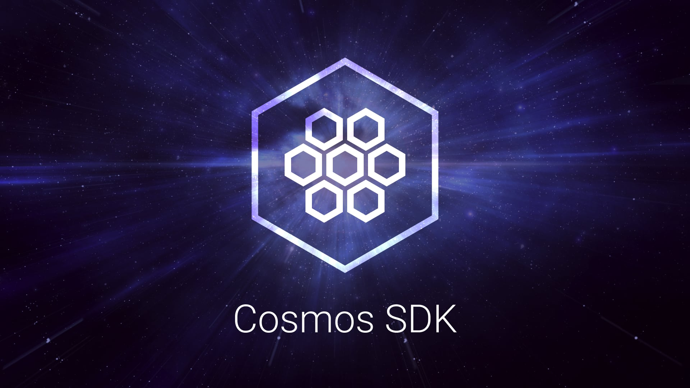

<!--
parent:
  order: false
-->

  <h1> Cosmos SDK </h1>

  
  
  
  
  

  
  
  
    
    

The Cosmos SDK is a framework for building blockchain applications. [Tendermint Core (BFT Consensus)](https://github.com/tendermint/tendermint) and the Cosmos SDK are written in the Golang programming language. Cosmos SDK is used to build [Gaia](https://github.com/cosmos/gaia), the first implementation of the Cosmos Hub.

**WARNING**: The Cosmos SDK has mostly stabilized, but we are still making some
breaking changes.

**Note**: Requires [Go 1.17+](https://golang.org/dl/)

## Quick Start

To learn how the Cosmos SDK works from a high-level perspective, see the Cosmos SDK [High-Level Intro](./docs/intro/overview.md).

If you want to get started quickly and learn how to build on top of Cosmos SDK, visit [Cosmos SDK Tutorials](https://tutorials.cosmos.network). You can also fork the tutorial's repository to get started building your own Cosmos SDK application.

For more information, see the [Cosmos SDK Documentation](./docs/).

## Contributing

See [CONTRIBUTING.md](./CONTRIBUTING.md) for details how to contribute and participate in our [dev calls](./CONTRIBUTING.md#teams-dev-calls).
If you want to follow the updates or learn more about the latest design then join our [Discord](https://discord.com/invite/cosmosnetwork).

## Tools and Frameworks

The Cosmos ecosystem is vast. We will only make a few notable mentions here.

+ [Tools](https://v1.cosmos.network/tools): notable frameworks and modules.
+ [CosmJS](https://github.com/cosmos/cosmjs): the Swiss Army knife to power JavaScript based client solutions.

### Cosmos Hub Mainnet

The Cosmos Hub application, `gaia`, has moved to its own [cosmos/gaia repository](https://github.com/cosmos/gaia). Go there to join the Cosmos Hub mainnet and more.

### Inter-Blockchain Communication (IBC)

The IBC module for the Cosmos SDK has moved to its own [cosmos/ibc-go repository](https://github.com/cosmos/ibc-go). Go there to build and integrate with the IBC module.

### Ignite CLI

Ignite CLI is the all-in-one platform to build, launch, and maintain any crypto application on a sovereign and secured blockchain. If you are building a new app or a new module, use [Ignite CLI](https://github.com/ignite-hq/cli) to get started and speed up development.

## Disambiguation

This Cosmos SDK project is not related to the [React-Cosmos](https://github.com/react-cosmos/react-cosmos) project (yet). Many thanks to Evan Coury and Ovidiu (@skidding) for this Github organization name. As per our agreement, this disambiguation notice will stay here.

## Changes to Cudos fork of cosmos-sdk

Below are described the changes that Cudos have implemented to the cosmos-sdk for the purpose of Cudos Network.

### Burned tokens to community pool

In the original cosmos-sdk there are several cases where tokens are being burned. We can separate them into two categories - staking coins burns and vouches (ibc denom tokens, Gravity Bridge denoms) burns. The vouches are being burned for the purpose of not going over the cap when transferring them back and forth. The staking coin's burns are more of a deflation mechanic.

In Cudos Network the burned staking coins (acudos) are sent to the community pool and the burn mechanic for the vouchers is left as it is.

This is achieved by changing the `BurnCoins` function in bank module's keeper. It is being called anywhere there is burning of coins, so it is a central place where we can implement the change with a single fix. 

For it to work the app's distribution keeper should be passed to the bank keeper. Because of this we've added a check in the `BurnCoins` function to check this. There is also another check for the denom of the coins being burned - if it is `acudos`, transfer them to the community pool, if it is any other - use the old logic to burn them.

There is also a new test added to check this functionality and a log anytime burn or transfer to community pool is done.

### Crisis transactions only by admin token holders

In the original cosmos-sdk the crisis module's invariant check messages could be sent by anyone. For Cudos Network we limited them to only `adminToken` holders, since they produce heavy load on the network and could be used as an attack vector.

This is done by adding a simple check if the message sender has at least one `adminToken` in crisis module's `msg_server.go`. The other changes include just a specific error for the case when the caller doesn't have `adminToken` and some test suite changes to accomodate tests for those changes.

To test the cli commands for the invariants, we needed to add `adminToken` to the integration test suite's validator and that made it so all the checks for balances in the suite had to be modified to expect that new token.

### MinSelfDelegation minimum value 2000000000000000000000000

When validator is created there is a setting being set about the minimum self delegation amount required for the validator to be operational. For Cudos Network this is required to be at least 2M CUDOS. This is achieved with a check in the `CreateValidator` function in staking module's `msg_server.go`. Also we've added a check in the standard `ValdiateBasic` function for `MsgCreateValidator`.

There is also an additional error type added in `types/errors.go`.

The majority of changes are for the tests. Since we now require validators to have that setting, we also have to rise the actual self delegation they put on themselves. From there we have to give the addresses more funds, the calculated rewards are different and so on. That makes it so many changes in the tests are required just for this small setting change.

### Enabling flag parsing for evidence module

This is implemented fue to CUDOS-815 bug. Following query evidence cli command documentation, when passing no arguments it should return all the existing evidences. However, it looks like the command is parsing incorrectly the arguments, since cudos-noded q evidence returns error `Error: accepts at most 1 arg(s), received 5`

The problem was that the settings of the evidence module query Txs was ignoring flags, furthermore considering them as arguments of the call, leading to troublesome behaviour.

The fix is just changing `DisableFlagParsing` to falsein evidence module's `cli/query.go` `GetQueryCmd`.

### [CUDOS-805] Empty moniker is not allowed for validators

This is implemented due to CUDOS-805. Validators with empty monikers should not be allowed on Cudos Network.

This is achieved through checks added in `validator.go`'s `EnsureLength` function, in the `ValidateBasic` functions for Create  and edit validator messages and in the functions for cli tx. Some tests where validators are created had to be edited as well, to set them up with any mnemonic as opposed to the default empty mnemonic.

### update: tendermint 0.34.19

There was an issue with older versions of Tendermint, where under heavy load connections between nodes would drop and never come back again, until the node is restarted. In Tendermint v0.34.19 this was fixed and that is the reason for this preemptive update.

### added unsafe-reset-all on root level

In the original cosmos-sdk version v0.45.3 the `unsafe-reset-all` was moved from the root cmd level. We've returned it back there in order to not change all the deployment and upgrade scripts we have.

### Add group module

We needed the group module prior to upgrading our whole cosmos-sdk, so we copied it manually.

### CUDOS-1363 added error when querying pruned height

When querying pruned heights, in the original cosmos-sdk no error is thrown, but rather an empty result is returned. We changed this so an error is thrown.

The main fix is in `store.go` where a check was already present for this, but it was returning `nil` as error. We created a new error type and put it as a return in that case.

A few tests needed refactoring to accomodate this fix as well.

### CUDOS-1482 cosmos-sdk fix to validator edit bug

There was a bug in cosmos-sdk v0.45.3 where, when editing a validator info without specifying a new moniker, a "test" moniker was set. This was fixed in newer cosmos-sdk versions, but we wanted this before we update the whole cosmos-sdk, so we implemented it manually.

The fix consists in adding a new flag for editted moniker and checking if it was entered.

### CUDOS-1464 added authz non-determinism module fix

There was a non-determinism bug in cosmos-sdk, which was quickly fixed in new coosmos-sdk versions. We added it manually so we can have it asap.

The fix consists in sorting the keys in `events.go`'s `TypedEventToEvent`, before iterating over them, so that they are always iterated in the same order.

There was also a test added.
